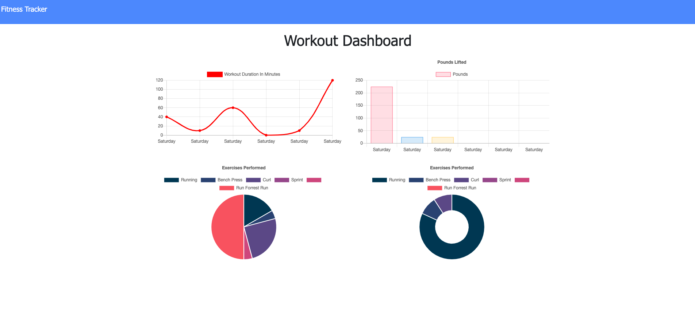

# Workout-Tracker

David K. Brown's Workout-Tracker App

## Table of Contents

- [Description](#description)

- [Screenshots](#screenshots)

- [Acceptance-Criteria](#Acceptance-Criteria)

- [Installation](#installation)

- [Credits](#credits)

- [Contributing](#contributing)

- [Copyright](#copyright)

## Description

The purpose of this app is to allow a user to track their workouts. The workouts can be Cardio or Resistance and then the name, distance, weight, sets, reps and duration can be customized. Multiple exercises can be logged on a given day. The end goal for this app is to allow the user to reach their fitness goals more quickly when they track their workout progress.

## Screenshots



## Acceptance-Criteria

```md
When the user loads the page, they should be given the option to create a new workout or continue with their last workout.

The user should be able to:

- Add exercises to the most recent workout plan.

- Add new exercises to a new workout plan.

- View the combined weight of multiple exercises from the past seven workouts on the `stats` page.

- View the total duration of each workout from the past seven workouts on the `stats` page.
```

## Installation

To access this application you will need to visit my GitHub page and the "Workout-Tracker" repository. After the repository is cloned/forked you can make edits to the application in your repository. Any questions should be directed to [David Brown](mailto:gatech55@gmail.com). The application repository can be found here: [Workout-Tracker](https://github.com/GaTech55/Workout-Tracker). The Heroku site can be found here: [Workout-Tracker](https://agile-fjord-40111.herokuapp.com/?id=5ffa7ed0d8ddfc0017e58fc7).

## Credits

© 2019 Trilogy Education Services, a 2U, Inc. brand. All Rights Reserved.
[GitLab-17-Homework](https://gt.bootcampcontent.com/GT-Coding-Boot-Camp/gt-inc-fsf-pt-08-2020-u-c/tree/master/17-NoSQL/02-Homework)

## Contributing

| **Commits** | **Contributor** |

| 9| [GaTech55](https://github.com/GaTech55)|

## Copyright

Copyright (c) 2020 David Brown.
